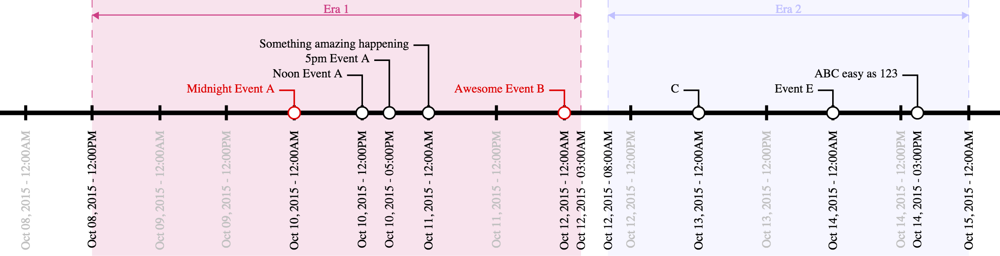

<h1 align="center">
    <b>Pytimeline</b>
</h1>

`pytimeline` is a command line tool for the creating of SVG timelines from JSON.

<p align="center">
  
</p>

Note: This is a rewrite of the old [timeline script](https://github.com/jasonreisman/Timeline) from Jason Reisman and full credits go to him for most of the work.

## Install

The package is compatible with `Python 3.7+` and can be installed in your current environment with `pip`:
```bash
python -m pip install pytimeline
```

## Usage

When the package is installed in your activated environment, it can be called through `python -m colorframe`.
Detailed usage goes as follows:
```bash
Usage: python -m pytimeline [OPTIONS]

Options:
  --inputfile PATH                Path to the input JSON file with the
                                  timeline data.  [required]
  --outputdir DIRECTORY           Path to the directory in which to write the
                                  output SVG file. If not provided, will
                                  pickthe directory of the input file.
  --logging [trace|debug|info|warning|error|critical]
                                  Sets the logging level.  [default: info]
  --help                          Show this message and exit.
```

The script will parse your input file and export the `SVG` document in the provided output folder or, if not provided, in the same directory as the input file.

One can otherwise import the high-level object from the package and use it directly:
```python
from pytimeline import Timeline

timeline = Timeline(inputfile="your_input.json")
timeline.build()
timeline.save("timeline.svg")
```

## Input Data Format

The input file is a `JSON` document that describes the start and end points of the timeline, tickmarks along the main axis, as well as callouts to specifc dates/times, and eras which highlight temporal periods.

All date fields can be described in several common date formats and may optionally also include a time of day (e.g. "3/14/15 9:26am").
Datetime parsing is handled by the `pendulum` package, and one can find all the accepted date formats [in the relevant documentation](https://pendulum.eustace.io/docs/#parsing).

### Required and Optional Fields

The required fields are `width`, `start`, and `end`. 
All other fields are optional.  

**Required:**
* `width` describes the width, in pixels, of the output SVG document, and the height will be determined automatically.
* `start` is the date/time of the leftmost date/time on the axis.
* `end` is the date/time of the rightmost date/time on the axis.

**Optional:**
* `num_ticks` contols the number of tickmarks along the axis between the `start` and `end` date/times (inclusive).  If this field is not present, no tickmarks will be generated except for those at the `start` and `end` dates.
* `tick_format` describes the string format of the tickmarks along the axis. See the [valid formats](https://pendulum.eustace.io/docs/#formatter) for the `pendulum` package.

### Special Fields

#### Callouts

Callouts along the axis are described in the `callouts` list, in which each entry is also a list with two to three string values:
* The first value is the `description` of the callout (e.g., "Pi Day"). It is required.
* The second value is the `date/time` of the callout (e.g., "3/14/15 9:26am"). It is required.
* The third value can specify a `color` for the callout, either as a hexcode or a valid SVG color alias. It is optional.

Callout examples:
```JSON
["Ultimate Pi Day", "3/14/15 9:26am"]
```
Or, with a custom callout color:
```JSON
["Ultimate Pi Day", "3/14/15 9:26am", "#CD3F85"]
```
#### Eras

Eras are highlighted temporal periods and are described in the `eras` list.
Like the `callouts` list, each entry in the eras list is itself a list with either three or four string values:
* The first value is the `description` of the era (e.g., "Summer"). It is required.
* The second value is the start `date/time` of the era (e.g., "6/21/15 12am"). It is required.
* The third value is the end `date/time` of the era (e.g. "9/20/15 11:59pm"). It is required.
* The fourth value can specify a `color` for the era, either as a hexcode or a valid SVG color alias. It is optional.

Era examples:
```JSON
["Summer 2015", "6/21/15 12am", "9/20/15 11:59pm"]
```
Or, with a custom era color:
```JSON
["Summer 2015", "6/21/15 12am", "9/20/15 11:59pm", "Orange"]
```

## Simple Example

The `JSON` input for the example timeline at the top of this `README` is:
```json
{
	"width" : 750,
	"start" : "Oct 8 2015",
	"end" : "Oct 15 2015",	
	"num_ticks" : 14,
	"tick_format" : "%b %d, %Y - %I:%M%p",
	"callouts" : [
		["ABC easy as 123", "Oct 14, 2015 3pm"],		
		["Midnight Event A", "12am Oct 10, 2015", "#DD0000"],
		["Noon Event A", "12pm Oct 10, 2015"],		
		["5pm Event A", "5pm Oct 10, 2015"],				
		["Something amazing happening", "Oct 11, 2015"],
		["Awesome Event B", "Oct 12, 2015", "#DD0000"],
		["C", "Oct 13, 2015"],
		["Event E", "Oct 14, 2015"]
	],
	"eras" : [
		["Era 1", "12pm Oct 8, 2015", "3am Oct 12, 2015", "#CD3F85"],
		["Era 2", "8am Oct 12, 2015", "12am Oct 15, 2015", "#C0C0FF"]
	]
}
```